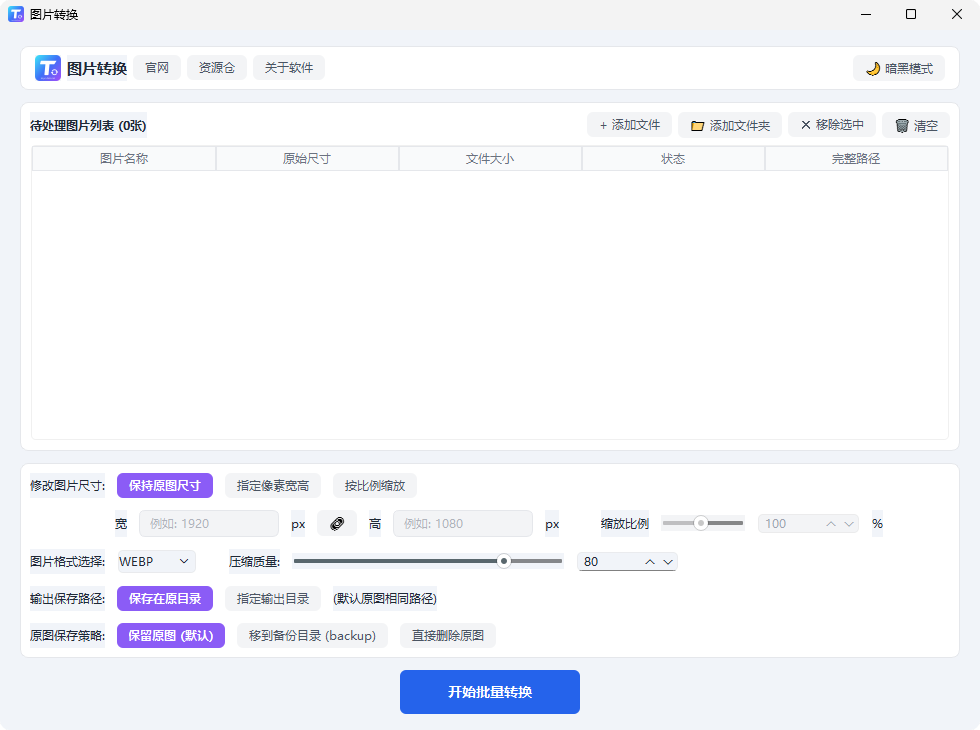
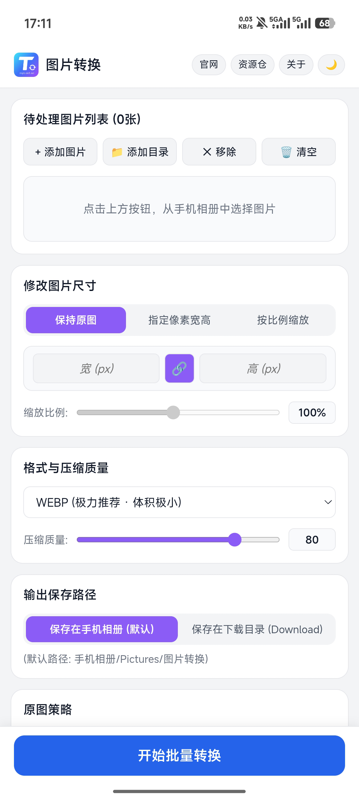

  <!-- ================= 第 1 屏：Hero 首屏 (锚点: #hero) ================= -->
  <section class="hero-screen" id="hero">
    

      🟢 绿色免安装
      🛡️ 100% 本地离线处理
      🎁 永久免费无套路
      🚫 无广告·无捆绑
    

    <!-- 超粗饱满渐变主标题 -->
    <h1 class="hero-title">轻快、纯粹，为效率而生的 本地图片批量转换工具</h1>
    
无需繁琐安装，开箱即用。轻松解决多图片格式互转、尺寸智能缩放与画质微调，守护您的核心图片数据安全。

    <!-- 双端直接下载入口卡片 -->
    

      <!-- Windows 下载卡片 -->
      

        

          

            💻
            

              <h3 class="dl-card-title">Windows 客户端</h3>
              绿色便携包
            

          

          

            适用: Windows 10 / 11 (64-bit) 
            特性: 解压即用 · 无注册表残留
          

        

        <a href="#changelog" class="dl-btn">下载 Windows 版 (v1.0.0)</a>
      

      <!-- Android 下载卡片 -->
      

        

          

            📱
            

              <h3 class="dl-card-title">Android 客户端</h3>
              原生 APK
            

          

          

            适用: Android 9.0 及以上系统 
            特性: 便携触控 · 手机图片快速转换
          

        

        <a href="#changelog" class="dl-btn dl-btn-green">下载 Android 版 (APK)</a>
      

    

  </section>

  <!-- ================= 第 2 屏：电脑端专屏展示 (锚点: #preview) ================= -->
  <section class="section-block" id="preview">
    

      
Desktop Experience

      <h2 class="section-title">电脑端：为桌面生产力深度优化</h2>
      
专为键盘鼠标操作打磨的大屏幕高效布局，从容应对海量图片处理。

    

    

      <!-- 电脑端窗口展示 (assets/002.png) -->
      

        

          
          
          
          图片转换 (k资源仓) - 桌面端
        

        
      

      <!-- 电脑端重点介绍 -->
      

        

          
⚡

          

            <h4>多核心高速批处理</h4>
            
支持一键拖拽数千张图片或整目录递归导入，充分调用本地多核心 CPU，多任务排队瞬间完成。

          

        

        

          
📐

          

            <h4>像素级精准尺寸控制</h4>
            
支持自由指定宽高像素，配备一键「比例锁定」链条，防止画面拉伸变形；亦可自由按百分比等比缩放。

          

        

        

          
🛡️

          

            <h4>备份安全机制 (后悔药)</h4>
            
支持自动生成 backup 备份文件夹存放原图，转换后的新文件独立输出，让桌面归档井然有序。

          

        

        

          
🌙

          

            <h4>原生级暗黑模式</h4>
            
完美契合 Windows 11 深色主题，长时间批量处理与归档不刺眼，专注提升工作流效率。

          

        

      

    

  </section>

  <!-- ================= 第 3 屏：手机端专屏展示 ================= -->
  <section class="section-block">
    

      
Mobile Experience

      <h2 class="section-title">手机端：随身携带的相册瘦身利器</h2>
      
专为触屏优化的单手流线型操作，随时随地转换分享。

    

    

      <!-- 手机端重点介绍 -->
      

        

          
📱

          

            <h4>触控交互极简直觉</h4>
            
一键调起系统相册或指定文件夹，支持批量点选与快速移除，大按钮防误触，单手即可轻松搞定。

          

        

        

          
📂

          

            <h4>系统相册智能归类</h4>
            
默认保存至 <code>手机相册/Pictures/图片转换</code> 或 <code>Download</code> 目录，转换完毕打开系统相册立即可见。

          

        

        

          
🪶

          

            <h4>轻巧省电无后台偷跑</h4>
            
基于 Android 9.0+ 深度优化，安装包极小，转码完成后立即释放内存，不常驻后台，不消耗多余电量。

          

        

        

          
🔒

          

            <h4>无网络离线转码保护隐私</h4>
            
无需消耗任何手机蜂窝流量，高铁无信号或飞行模式下均能顺畅使用，个人自拍与证件照绝无外泄风险。

          

        

      

      <!-- 手机端界面展示 (assets/003.png) -->
      

        

          

            
          

        

      

    

  </section>

  <!-- ================= 第 4 屏：安全与纯粹理念 ================= -->
  <section class="section-block">
    

      
Pure & Safe

      <h2 class="section-title">拒绝臃肿，回归工具本质</h2>
      
把隐私和掌控权还给用户，打造纯粹干净的本地生产力利器。

    

    

      

        
🔒

        <h4>纯本地离线处理</h4>
        
所有格式转码与压缩均在本地计算机中计算，数据 0 上传，照片与商业设计稿私密无忧。

      

      

        
⚡

        <h4>绿色免安装即用</h4>
        
下载解压直接运行，不写多余注册表与开机自启。装进 U 盘，随时随地随插即用。

      

      

        
🍃

        <h4>零广告无弹窗</h4>
        
没有烦人的弹窗提醒、没有捆绑软件、没有诱导付费，启动极速，心无旁骛。

      

      

        
💎

        <h4>永久免费开放</h4>
        
不限转换数量、不限制图片分辨率上限、无隐藏付费水印，面向所有用户免费开放。

      

    

  </section>

  <!-- ================= 第 5 屏：常见问题 FAQ (锚点: #faq) ================= -->
  <section class="section-block" id="faq">
    

      
FAQ

      <h2 class="section-title">常见问题解答</h2>
      
关于软件的使用与安全性说明。

    

    

      

        
转换过程中需要连接互联网吗？

        
完全不需要。软件的所有核心转码与尺寸缩放库均封装在本地程序内，拔掉网线或离线状态下同样可以满速运行。

      

      

        
软件真的完全免费且不限制转换张数吗？

        
是的。无论是 1 张、100 张还是上千张图片，均可一次性加入队列批量完成，无隐藏付费，无数量门槛。

      

      

        
Windows 首次打开提示“未知发布者”或安全拦截怎么办？

        
由于个人开发的绿色便携软件未采购昂贵的企业签名证书，Windows SmartScreen 可能会产生常规拦截提示。点击「更多信息」并选择「仍要运行」即可正常开启，软件保证无任何后门与病毒行为。

      

      

        
后续有新版本时，该如何更新？

        
软件为绿色便携版本，未来发布新版本只需在本页面下载最新的绿色包，解压覆盖旧文件即可完成更新。

      

    

  </section>

  <!-- ================= 第 6 屏：更新记录时间线 (锚点: #changelog) ================= -->
  <section class="changelog-section" id="changelog">
    

      <h2 class="section-title" style="color: #2563eb;">更新记录</h2>
      
持续迭代中，欢迎反馈建议

    

    

      
      <!-- 节点 1: 最新版本 (默认可见) -->
      

        

        

          <h3 class="timeline-version-title">v1.0.x — 新版本优化中</h3>
          
持续迭代中

        

        

          

            ✨
            
优化大批量图片转换时的内存开销，提升极端多图场景下的转码稳定性

          

          

            ✨
            
优化移动端 Android 界面在全面屏与手势导航下的边距与触控体验

          

          

            ✨
            
收集首发版本用户反馈，持续修复已知交互细节与边界兼容性问题

          

        

      

      <!-- 纯净折叠器：历史版本收纳 (无多余背景框) -->
      

        

          

            

            

              <h3 class="timeline-version-title">v1.0.0 — 图片转换工具诞生</h3>
              
首发正式版

            

            

              

                🛡️
                
纯本地离线处理：所有转码均在本地硬件执行，数据 0 上传，彻底保护个人与商业图像隐私

              

              

                ✨
                
绿色便携无广告：单文件即下即用，不写入无关注册表，零弹窗、零诱导推广

              

              

                ✨
                
主流多格式互转：深度支持 WebP、PNG、JPG/JPEG 等现代主流格式双向高速转码

              

              

                ✨
                
图片质量自由选择：提供 1~100 无级质量滑块调节，精准平衡图像体积与清晰度

              

              

                ✨
                
3 大尺寸重塑模式：支持保持原图尺寸、指定像素宽高（配备比例锁定）及百分比自由缩放

              

              

                ✨
                
输出路径与原图策略：支持保存至原目录或指定目录；原图支持保留、自动移至 backup 备份或直接清理

              

              

                ✨
                
现代极简界面：扁平无多余层级设计，内置一键「暗黑模式」，夜间批量处理护眼更舒适

              

              

                ✨
                
双端首发覆盖：同步发布 Windows 10/11 (64-bit) 桌面版 与 Android 9.0+ 移动版

              

            

          

        

        

          
            展开全部更新记录 ▾
            收起历史更新记录 ▴
          
        

      

    

    <!-- 底部友链与版权 -->
    

      
© 2026 图片转换 · 资源仓 · 专注于效率提升的轻量工具

      

        <a href="#hero">官网首页</a> ·
        <a href="#">资源仓</a> ·
        <a href="#">关于软件</a> ·
        <a href="#">问题反馈</a>
      

    

  </section>

<!-- 顶栏双增强脚本：挂载导航锚点 + 挂载打赏作者按钮 + 标题文本锁定 -->
